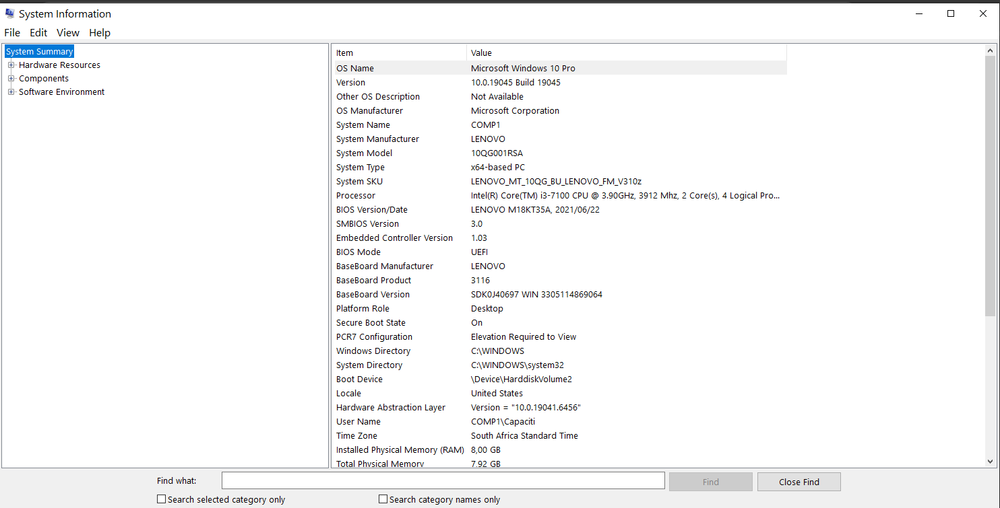
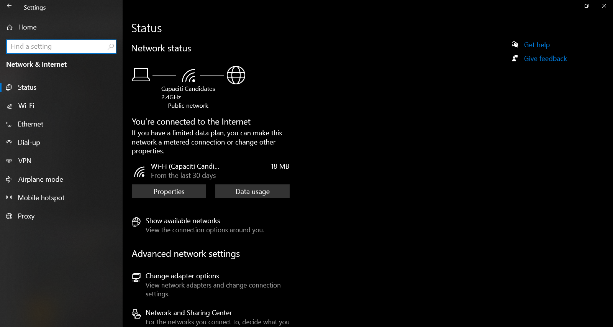
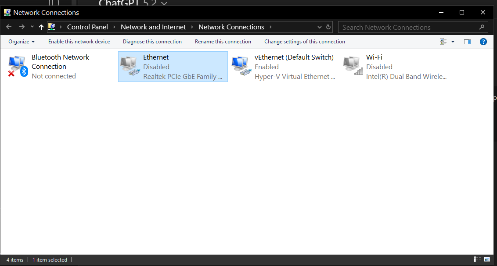
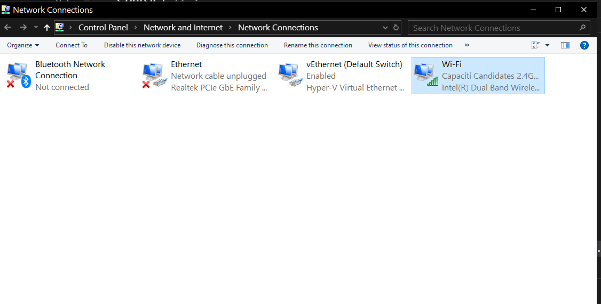
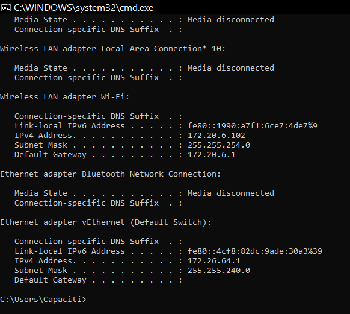

# Technical Support Fundamentals – System Check & Troubleshooting Report

## 1. System Information
- Operating System: Microsoft Windows 10 Pro
- Processor: Intel(R) Core(TM) i3-7100 CPU  @ 3.90GHz, 3912 Mhz, 2 Core(s), 4Logical Pro...
- RAM: 8,00 GB
- System Type: x64-based PC

## 2. Network Status Check
- Checked network connection using Windows Settings and Command Prompt (ipconfig).
- The system was initially connected to the internet.

## 3. Simulated Issue
- I disabled the network adapter to simulate an internet disconnection.
- The system lost internet connectivity.

## 4. Troubleshooting Steps
- Checked network status.
- Identified that the network adapter was disabled.
- Re-enabled the network adapter.

## 5. Result
- Internet connection was restored successfully.

## 6. Screenshots
- System information
- Network status
- Network disabled
- Network enabled
  
### System Information

### Network Status

### Network Disabled

### Network Enabled

### IP Configuration (ipconfig)

